# HackHub — Database Entity Relationships

**Document Version:** 1.0.0  
**Target Engine:** MongoDB 7.0+ / Mongoose  
**Audience:** Backend Team & Database Administrators  

---

## 1. Architectural Relationship Overview

HackHub uses **referenced relationships** with normalized MongoDB collections. This architecture prevents document bloating, unbounded arrays, and concurrency conflicts, while enforcing zero-trust authorization boundaries.

### Core Architectural Rules:
1. **Never embed complete User documents inside Team:** Teams only store `createdBy` (captain ref), while individual memberships belong to the `Membership` junction collection.
2. **Never embed Task documents inside User:** Tasks are scoped to a specific team and event, with `ownerId` referencing `User`.
3. **Workspace Authorization via Membership:** Team workspace routes (`/api/teams/:id/*`) must verify that the requesting user has an `active` record in `Membership` for that `teamId` (or is an event `ORGANIZER` / assigned `MENTOR`).
4. **Single Active Membership Per Event:** A participant can only hold one `active` team membership per hackathon.

---

## 2. Entity-Relationship (ER) Diagram

```mermaid
erDiagram
    USER ||--|| PROFILE : "1:1 has profile"
    USER ||--o{ MEMBERSHIP : "1:N joins teams via"
    USER ||--o{ SESSION : "1:N authenticates with"
    USER ||--o{ REPUTATION : "1:N earns reputation points"
    USER ||--o{ NOTIFICATION : "1:N receives"
    USER ||--o{ INVITATION : "1:N sends / receives"
    USER ||--o{ JOIN_REQUEST : "1:N requests to join"

    EVENT ||--o{ CHALLENGE : "1:N hosts tracks"
    EVENT ||--o{ TEAM : "1:N registers squads"
    EVENT ||--o{ RUBRIC : "1:N defines versions"
    EVENT ||--o{ DOCUMENT : "1:N publishes rulebooks"
    EVENT ||--o{ AUDIT_LOG : "1:N audits events"

    CHALLENGE ||--o{ TEAM : "1:N chosen by"

    TEAM ||--o{ MEMBERSHIP : "1:N comprises members"
    TEAM ||--o{ JOIN_REQUEST : "1:N receives requests"
    TEAM ||--o{ INVITATION : "1:N issues invites"
    TEAM ||--o{ TASK : "1:N manages sprint tasks"
    TEAM ||--o{ MILESTONE : "1:N tracks progress milestones"
    TEAM ||--|| SUBMISSION : "1:1 delivers project"
    TEAM ||--o{ FEEDBACK : "1:N receives mentor advice"
    TEAM ||--o{ AGENT_RUN : "1:N runs delivery AI planner"

    SUBMISSION ||--o{ SCORE : "1:N evaluated by judges"

    DOCUMENT ||--o{ CHUNK : "1:N chunked into vectors"

    USER {
        ObjectId _id PK
        string name
        string email UK
        string role
        Date createdAt
    }

    PROFILE {
        ObjectId _id PK
        ObjectId userId FK
        string specialization
        string[] skills
        boolean discoveryConsent
    }

    EVENT {
        ObjectId _id PK
        string name
        string slug UK
        ObjectId organizerId FK
        Date submissionDeadline
        string status
    }

    CHALLENGE {
        ObjectId _id PK
        ObjectId eventId FK
        string title
        string track
        string category
    }

    TEAM {
        ObjectId _id PK
        ObjectId eventId FK
        ObjectId challengeId FK
        string name
        ObjectId createdBy FK
        string status
    }

    MEMBERSHIP {
        ObjectId _id PK
        ObjectId userId FK
        ObjectId teamId FK
        ObjectId eventId FK
        string role
        string status
    }

    JOIN_REQUEST {
        ObjectId _id PK
        ObjectId teamId FK
        ObjectId eventId FK
        ObjectId requesterId FK
        string status
    }

    INVITATION {
        ObjectId _id PK
        ObjectId inviterId FK
        ObjectId inviteeId FK
        ObjectId eventId FK
        ObjectId teamId FK
        string status
    }

    TASK {
        ObjectId _id PK
        ObjectId eventId FK
        ObjectId teamId FK
        ObjectId ownerId FK
        string status
        string priority
        number version
    }

    MILESTONE {
        ObjectId _id PK
        ObjectId eventId FK
        ObjectId teamId FK
        string title
        Date dueDate
        number completionPercentage
    }

    RUBRIC {
        ObjectId _id PK
        ObjectId eventId FK
        number version
        array criteria
        number totalMaxScore
    }

    SUBMISSION {
        ObjectId _id PK
        ObjectId eventId FK
        ObjectId teamId FK,UK
        ObjectId challengeId FK
        string repositoryUrl
        string deploymentUrl
        string status
        number revision
    }

    SCORE {
        ObjectId _id PK
        ObjectId eventId FK
        ObjectId submissionId FK
        ObjectId judgeId FK
        number totalScore
    }

    DOCUMENT {
        ObjectId _id PK
        ObjectId eventId FK
        string title
        string version
        string status
    }

    CHUNK {
        ObjectId _id PK
        ObjectId documentId FK
        ObjectId eventId FK
        string text
        array embedding
    }

    AGENT_RUN {
        ObjectId _id PK
        ObjectId eventId FK
        ObjectId teamId FK
        ObjectId requestedBy FK
        string status
        object proposal
    }

    FEEDBACK {
        ObjectId _id PK
        ObjectId eventId FK
        ObjectId teamId FK
        ObjectId mentorId FK
        string message
    }

    REPUTATION {
        ObjectId _id PK
        ObjectId userId FK
        ObjectId eventId FK
        number points
        string type
    }

    NOTIFICATION {
        ObjectId _id PK
        ObjectId userId FK
        string type
        boolean isRead
    }

    SESSION {
        ObjectId _id PK
        ObjectId userId FK
        string tokenHash UK
        boolean isValid
        Date expiresAt
    }

    AUDIT_LOG {
        ObjectId _id PK
        ObjectId eventId FK
        ObjectId actorId FK
        string action
        ObjectId entityId FK
    }
```



---

## 3. Scope Boundaries & Hierarchy

### 3.1 Event Scope Boundary
All operational entities (Challenges, Teams, Memberships, Rubrics, Submissions, Documents) are explicitly scoped with an `eventId` foreign key:
```
Event
├── Challenges (eventId)
├── Teams (eventId)
│   ├── Memberships (eventId, teamId)
│   ├── Tasks (eventId, teamId)
│   ├── Milestones (eventId, teamId)
│   ├── Submission (eventId, teamId)
│   │   └── Scores (eventId, submissionId)
│   ├── Feedbacks (eventId, teamId)
│   └── AgentRuns (eventId, teamId)
├── Rubrics (eventId)
├── Documents (eventId)
│   └── Chunks (eventId, documentId)
└── AuditLogs (eventId)
```

**Why explicit `eventId` on sub-entities?**
Query performance and multi-tenant isolation. When querying team tasks, submissions, or judge evaluations, backend services can enforce event isolation in a single indexed filter query without performing multi-level `$lookup` joins.

---

### 3.2 User Scope Boundary
Independent of specific hackathons, users maintain long-term collegiate standing:
```
User
├── Profile (1:1 via userId)
├── Sessions (1:N via userId)
├── Reputation History (1:N via userId)
├── Notifications (1:N via userId)
└── Memberships (1:N across different events)
```

---

## 4. Referential Integrity & Cascading Rules

| Action | Impacted Collections | Cascade Policy | Rationale |
|---|---|---|---|
| **User Deactivated** | `Profile`, `Membership`, `Session` | Soft-disable (`isActive: false`), invalidate active sessions. | Preserves historical submissions and score ledgers. |
| **Team Disbanded** | `Membership`, `Task`, `JoinRequest` | Mark `Team.status = 'archived'`. Mark `Membership.status = 'removed'`. Reject pending `JoinRequest`. | Do NOT delete submitted code or scoring history. |
| **Member Removed** | `Membership`, `Task` | Update `Membership.status = 'removed'`. Unassign `Task.ownerId` (`ownerId: null`, `ownerName: 'Unassigned'`). | Prevents dangling assignee references on sprint boards. |
| **Submission Locked** | `Submission`, `Score` | Set `Submission.status = 'locked'`. Prevent subsequent `PUT /api/submissions/:teamId`. | Guarantees frozen state for jury grading. |
| **Rubric Versioned** | `Rubric` | Create new document with `version: N+1`, deactivate old. Existing `Submission` retains old `rubricVersion`. | Preserves integrity of scores given under prior rubrics. |
